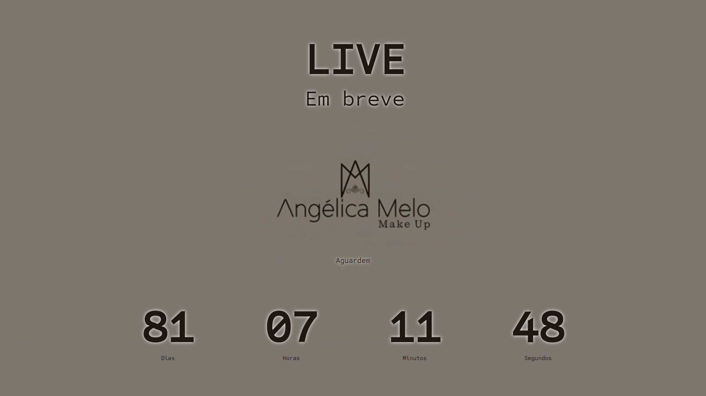

<h1 align="center"> Count Down ⏳⏱️ </h1>

# Sobre o projeto ✨💄🍾
Esse projeto é uma contagem regressiva feito para uma maquiadora que possui sua linha própria.
A data utilizada é fictícia.
Utilizei pequenas funções e consegui aperfeiçoar meus conhecimentos em setInterval() e em algumas estilizações CSS.

 

# Como acessar o projeto? 🤔

Basta clicar [AQUI](https://analudms.github.io/CountDown/) que você será direcionado!

# Apresentação 👀

  

# Tecnologias 💻
- HTML e CSS.
- JavaScript.
- Git e Github.

# Autor 👩🏻

Ana Luiza de Melo Soares.  
https://www.linkedin.com/in/ana-luiza-melo-8b94181b3/
